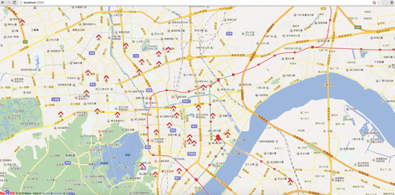
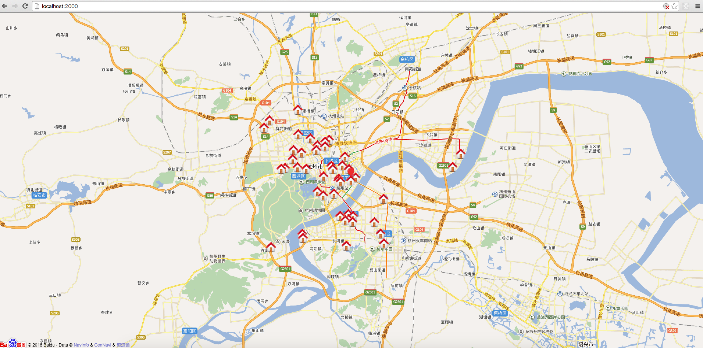
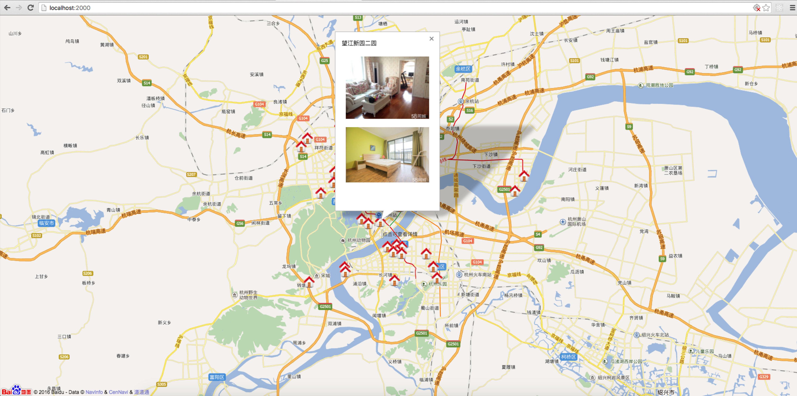

# Rental app based on Node.js

## 运行

	cd Rental
	npm install
	npm start

	open localhost:2000

## 简介

基于Node.js的爬虫系统。

爬取58同城上的杭州租房信息，并用百度地图进行可视化显示，方便用户快速查找自己附近的租房信息。

   

     

教程：

[http://answershuto.github.io/jekyll/update/2016/10/25/养只爬虫当宠物-Node.js爬虫爬取58同城租房信息.html](http://answershuto.github.io/jekyll/update/2016/10/25/养只爬虫当宠物-Node.js爬虫爬取58同城租房信息.html)
